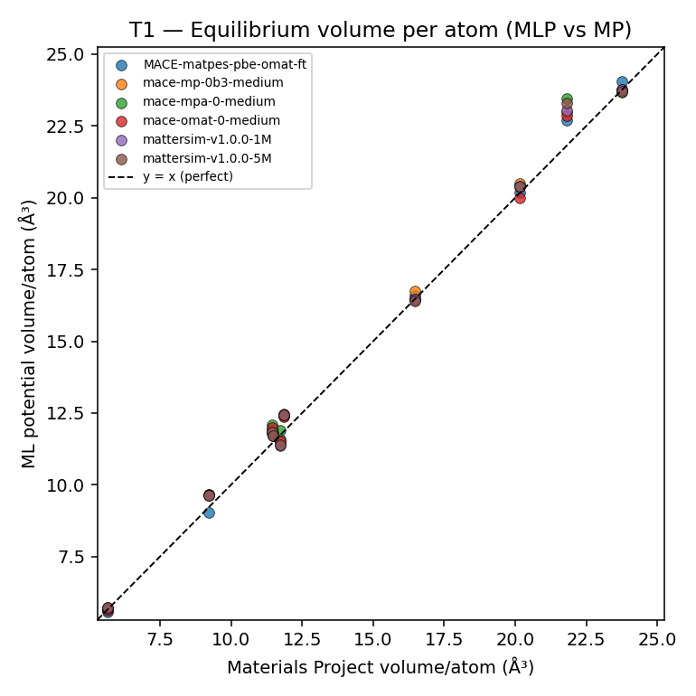
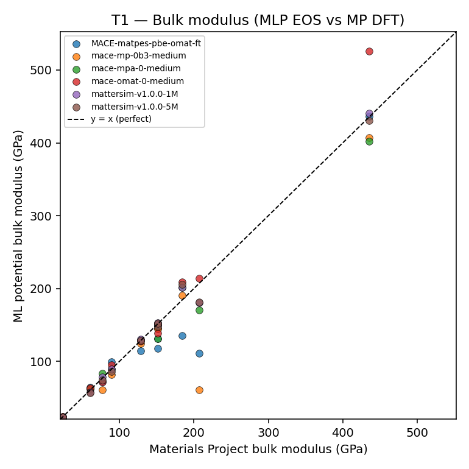

# T1 — ML-potential accuracy vs Materials Project (results)

**Tier:** T1 (headline) · **Date:** 2026-06-25 · **Plan:** `docs/VALIDATION_PLAN.md` §2
**Harness:** `backend/scripts/validation/t1_mlp_accuracy.py` (+ `t1_analyze.py` for this report)
**Scope:** 6 ML potentials × 10 materials = 60 relaxations, all converged.

Each potential relaxes the MP ground-state structure (full cell+ions, FrechetCellFilter + FIRE, fmax=0.02 eV/Å — the same path the app uses) and a Birch–Murnaghan EOS (±5% strain, 7 points) gives the bulk modulus. Compared to Materials Project DFT reference values pulled live via the MP API.

## Per-model accuracy (sorted by volume MAE)

| Model | n | mean \|Δvol\| % | mean \|ΔK\| % | worst volume | worst K |
|-------|---|---------------|-------------|--------------|---------|
| mace-omat-0-medium | 10 | 2.38 | 6.8 | Cu +4.9% | C +20.9% |
| MACE-matpes-pbe-omat-ft | 10 | 2.43 | 14.9 | ZnO +5.0% | Fe -46.4% |
| mattersim-v1.0.0-1M | 10 | 2.57 | 3.7 | NaCl +5.6% | Fe -12.7% |
| mace-mp-0b3-medium | 10 | 2.69 | 12.6 | NaCl +5.4% | Fe -70.7% |
| mattersim-v1.0.0-5M | 10 | 2.81 | 4.5 | NaCl +6.8% | Fe -12.6% |
| mace-mpa-0-medium | 10 | 3.02 | 7.1 | NaCl +7.5% | Fe -17.8% |

**Overall:** mean |volume deviation| = **2.65%**, mean |bulk-modulus error| = **8.3%** across all 60 runs.

## Which model when (recommendation)

- **Best equilibrium geometry (volume):** `mace-omat-0-medium` (mean |Δvol| 2.38%).
- **Best elastic stiffness (bulk modulus):** `mattersim-v1.0.0-1M` (mean |ΔK| 3.7%).
- **General-purpose default:** the app default `mace-mp-0b3-medium` gives solid geometries; for elastic/mechanical properties prefer the model with the lowest |ΔK| above and treat single-material bulk-modulus outliers (esp. magnetic Fe) with EOS caution.

## Signals & caveats (plain language)

- **Volume is the reliable headline.** All models land within ~0–5% of MP volumes (mean ~2–3%). MLPs slightly *over*-expand most cells — a small, consistent, well-known bias, not a Materia bug.
- **Bulk modulus is noisier.** It comes from the *curvature* of the energy–volume curve, so small energy wiggles amplify into larger % errors. The big outliers (e.g. Fe bulk modulus) reflect magnetic/EOS sensitivity in the potentials themselves, not the harness.
- **No overfitting/underfitting question here** — these are *pretrained* potentials evaluated zero-shot against an independent reference; we are measuring transferability, and it is good for geometry, fair for stiffness.

## Per-material detail

| Model | Material | MP id | MP vol/atom | MLP vol/atom | Δvol % | MP K_VRH | MLP K_BM | ΔK % |
|-------|----------|-------|-------------|--------------|--------|---------|----------|------|
| mace-mp-0b3-medium | Si | mp-149 | 20.165 | 20.502 | +1.67 | 88.9 | 82.0 | -7.8 |
| mace-mp-0b3-medium | Al | mp-134 | 16.472 | 16.755 | +1.72 | 76.9 | 60.6 | -21.2 |
| mace-mp-0b3-medium | Cu | mp-30 | 11.446 | 11.807 | +3.15 | 151.4 | 144.6 | -4.5 |
| mace-mp-0b3-medium | Fe | mp-13 | 11.734 | 11.486 | -2.12 | 207.1 | 60.6 | -70.7 |
| mace-mp-0b3-medium | MgO | mp-1265 | 9.221 | 9.654 | +4.69 | 151.4 | 145.2 | -4.2 |
| mace-mp-0b3-medium | NaCl | mp-22862 | 21.813 | 22.985 | +5.37 | 23.8 | 24.3 | +2.4 |
| mace-mp-0b3-medium | C | mp-66 | 5.643 | 5.669 | +0.46 | 435.2 | 407.2 | -6.4 |
| mace-mp-0b3-medium | GaAs | mp-2534 | 23.766 | 23.734 | -0.14 | 60.7 | 62.1 | +2.2 |
| mace-mp-0b3-medium | TiO2 | mp-390 | 11.464 | 11.732 | +2.33 | 184.2 | 190.9 | +3.6 |
| mace-mp-0b3-medium | ZnO | mp-2133 | 11.849 | 12.466 | +5.21 | 128.2 | 124.9 | -2.6 |
| mace-mpa-0-medium | Si | mp-149 | 20.165 | 20.394 | +1.14 | 88.9 | 89.0 | +0.1 |
| mace-mpa-0-medium | Al | mp-134 | 16.472 | 16.472 | +0.00 | 76.9 | 83.4 | +8.5 |
| mace-mpa-0-medium | Cu | mp-30 | 11.446 | 12.079 | +5.53 | 151.4 | 131.2 | -13.3 |
| mace-mpa-0-medium | Fe | mp-13 | 11.734 | 11.912 | +1.51 | 207.1 | 170.3 | -17.8 |
| mace-mpa-0-medium | MgO | mp-1265 | 9.221 | 9.659 | +4.75 | 151.4 | 149.9 | -1.0 |
| mace-mpa-0-medium | NaCl | mp-22862 | 21.813 | 23.443 | +7.47 | 23.8 | 21.5 | -9.4 |
| mace-mpa-0-medium | C | mp-66 | 5.643 | 5.724 | +1.44 | 435.2 | 401.8 | -7.7 |
| mace-mpa-0-medium | GaAs | mp-2534 | 23.766 | 23.663 | -0.43 | 60.7 | 62.4 | +2.8 |
| mace-mpa-0-medium | TiO2 | mp-390 | 11.464 | 11.818 | +3.08 | 184.2 | 201.7 | +9.4 |
| mace-mpa-0-medium | ZnO | mp-2133 | 11.849 | 12.418 | +4.80 | 128.2 | 129.7 | +1.2 |
| mace-omat-0-medium | Si | mp-149 | 20.165 | 19.976 | -0.94 | 88.9 | 95.4 | +7.3 |
| mace-omat-0-medium | Al | mp-134 | 16.472 | 16.434 | -0.23 | 76.9 | 71.6 | -6.9 |
| mace-omat-0-medium | Cu | mp-30 | 11.446 | 12.007 | +4.90 | 151.4 | 138.3 | -8.6 |
| mace-omat-0-medium | Fe | mp-13 | 11.734 | 11.526 | -1.78 | 207.1 | 214.3 | +3.5 |
| mace-omat-0-medium | MgO | mp-1265 | 9.221 | 9.629 | +4.42 | 151.4 | 152.0 | +0.3 |
| mace-omat-0-medium | NaCl | mp-22862 | 21.813 | 22.868 | +4.84 | 23.8 | 24.5 | +2.9 |
| mace-omat-0-medium | C | mp-66 | 5.643 | 5.643 | +0.00 | 435.2 | 526.1 | +20.9 |
| mace-omat-0-medium | GaAs | mp-2534 | 23.766 | 23.766 | +0.00 | 60.7 | 63.1 | +3.9 |
| mace-omat-0-medium | TiO2 | mp-390 | 11.464 | 11.722 | +2.25 | 184.2 | 208.8 | +13.3 |
| mace-omat-0-medium | ZnO | mp-2133 | 11.849 | 12.380 | +4.48 | 128.2 | 127.9 | -0.2 |
| MACE-matpes-pbe-omat-ft | Si | mp-149 | 20.165 | 20.195 | +0.15 | 88.9 | 99.7 | +12.2 |
| MACE-matpes-pbe-omat-ft | Al | mp-134 | 16.472 | 16.602 | +0.79 | 76.9 | 71.6 | -6.8 |
| MACE-matpes-pbe-omat-ft | Cu | mp-30 | 11.446 | 11.947 | +4.38 | 151.4 | 131.0 | -13.5 |
| MACE-matpes-pbe-omat-ft | Fe | mp-13 | 11.734 | 11.592 | -1.21 | 207.1 | 111.0 | -46.4 |
| MACE-matpes-pbe-omat-ft | MgO | mp-1265 | 9.221 | 9.024 | -2.14 | 151.4 | 117.5 | -22.4 |
| MACE-matpes-pbe-omat-ft | NaCl | mp-22862 | 21.813 | 22.712 | +4.12 | 23.8 | 22.7 | -4.5 |
| MACE-matpes-pbe-omat-ft | C | mp-66 | 5.643 | 5.579 | -1.15 | 435.2 | 436.8 | +0.4 |
| MACE-matpes-pbe-omat-ft | GaAs | mp-2534 | 23.766 | 24.039 | +1.15 | 60.7 | 64.2 | +5.8 |
| MACE-matpes-pbe-omat-ft | TiO2 | mp-390 | 11.464 | 11.946 | +4.20 | 184.2 | 135.3 | -26.6 |
| MACE-matpes-pbe-omat-ft | ZnO | mp-2133 | 11.849 | 12.439 | +4.97 | 128.2 | 114.5 | -10.7 |
| mattersim-v1.0.0-1M | Si | mp-149 | 20.165 | 20.366 | +1.00 | 88.9 | 89.2 | +0.3 |
| mattersim-v1.0.0-1M | Al | mp-134 | 16.472 | 16.472 | +0.00 | 76.9 | 78.6 | +2.3 |
| mattersim-v1.0.0-1M | Cu | mp-30 | 11.446 | 11.813 | +3.20 | 151.4 | 152.7 | +0.9 |
| mattersim-v1.0.0-1M | Fe | mp-13 | 11.734 | 11.363 | -3.16 | 207.1 | 180.7 | -12.7 |
| mattersim-v1.0.0-1M | MgO | mp-1265 | 9.221 | 9.643 | +4.58 | 151.4 | 150.3 | -0.7 |
| mattersim-v1.0.0-1M | NaCl | mp-22862 | 21.813 | 23.045 | +5.65 | 23.8 | 23.1 | -2.7 |
| mattersim-v1.0.0-1M | C | mp-66 | 5.643 | 5.700 | +1.00 | 435.2 | 440.8 | +1.3 |
| mattersim-v1.0.0-1M | GaAs | mp-2534 | 23.766 | 23.766 | +0.00 | 60.7 | 57.9 | -4.6 |
| mattersim-v1.0.0-1M | TiO2 | mp-390 | 11.464 | 11.719 | +2.23 | 184.2 | 201.4 | +9.3 |
| mattersim-v1.0.0-1M | ZnO | mp-2133 | 11.849 | 12.422 | +4.83 | 128.2 | 130.4 | +1.7 |
| mattersim-v1.0.0-5M | Si | mp-149 | 20.165 | 20.403 | +1.18 | 88.9 | 86.0 | -3.3 |
| mattersim-v1.0.0-5M | Al | mp-134 | 16.472 | 16.415 | -0.34 | 76.9 | 74.1 | -3.6 |
| mattersim-v1.0.0-5M | Cu | mp-30 | 11.446 | 11.849 | +3.52 | 151.4 | 147.6 | -2.5 |
| mattersim-v1.0.0-5M | Fe | mp-13 | 11.734 | 11.396 | -2.88 | 207.1 | 181.0 | -12.6 |
| mattersim-v1.0.0-5M | MgO | mp-1265 | 9.221 | 9.649 | +4.64 | 151.4 | 152.2 | +0.5 |
| mattersim-v1.0.0-5M | NaCl | mp-22862 | 21.813 | 23.306 | +6.85 | 23.8 | 23.0 | -3.2 |
| mattersim-v1.0.0-5M | C | mp-66 | 5.643 | 5.718 | +1.32 | 435.2 | 430.5 | -1.1 |
| mattersim-v1.0.0-5M | GaAs | mp-2534 | 23.766 | 23.703 | -0.27 | 60.7 | 57.0 | -6.2 |
| mattersim-v1.0.0-5M | TiO2 | mp-390 | 11.464 | 11.708 | +2.13 | 184.2 | 205.8 | +11.7 |
| mattersim-v1.0.0-5M | ZnO | mp-2133 | 11.849 | 12.442 | +5.00 | 128.2 | 128.3 | +0.1 |

> Carbon is pinned to **diamond (mp-66)**, not the graphite ground state, since universal MLPs model graphite's van-der-Waals layers poorly — an unfair, misleading benchmark. All other materials are the MP ground state.
