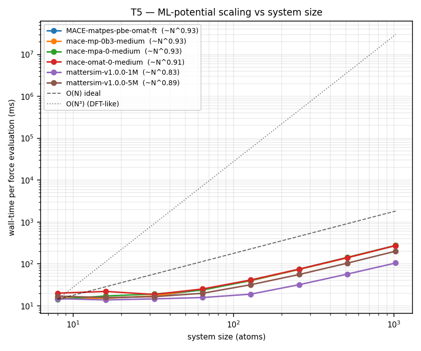
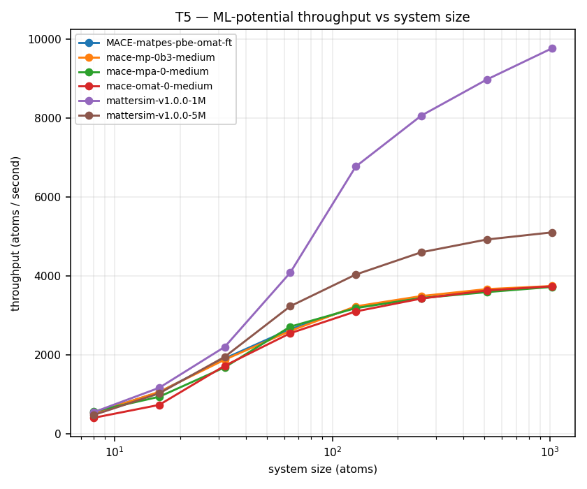

# T5 — Performance / scaling vs system size (results)

**Tier:** T5 (supporting) · **Date:** 2026-06-25 · **Plan:** `docs/VALIDATION_PLAN.md` §6
**Harness:** `backend/scripts/validation/t5_performance.py`
**Device:** CUDA · **Metric:** wall-time per energy+forces evaluation (the per-step cost of every relax / MD / NEB job).

Each model is timed on a geometric sweep of Si supercells (8 → 1024 atoms). Per measurement: a few warm-up calls (excluded), then several forced recomputes on a fixed geometry, CUDA-synchronised. The result cache is bypassed so every call is real work.

## Per-model scaling (sorted by large-system throughput)

| Model | asymptotic t∝N^p (large N) | small N (ms) | max N | max N (ms) | throughput @max (atoms/s) |
|-------|----------------------------|--------------|-------|------------|---------------------------|
| mattersim-v1.0.0-1M | 0.83 | 14.729 (N=8) | 1024 | 104.745 | 9776 |
| mattersim-v1.0.0-5M | 0.89 | 16.931 (N=8) | 1024 | 200.579 | 5105 |
| mace-mp-0b3-medium | 0.93 | 15.258 (N=8) | 1024 | 273.499 | 3744 |
| mace-omat-0-medium | 0.91 | 19.936 (N=8) | 1024 | 273.897 | 3739 |
| MACE-matpes-pbe-omat-ft | 0.93 | 15.136 (N=8) | 1024 | 274.482 | 3731 |
| mace-mpa-0-medium | 0.93 | 14.239 (N=8) | 1024 | 275.138 | 3722 |

## Per-(model, size) detail

| Model | supercell | N atoms | ms/eval | ±std | ms/atom | atoms/s | peak GPU (MB) | DFT est (s) | speedup vs DFT |
|-------|-----------|---------|---------|------|---------|---------|---------------|-------------|----------------|
| MACE-matpes-pbe-omat-ft | 1x1x1 | 8 | 15.136 | 1.104 | 1.892 | 528 | 214.4 | 0.03 | 2× |
| MACE-matpes-pbe-omat-ft | 1x1x2 | 16 | 15.191 | 0.25 | 0.9494 | 1053 | 244.1 | 0.25 | 16× |
| MACE-matpes-pbe-omat-ft | 1x2x2 | 32 | 16.791 | 0.332 | 0.5247 | 1906 | 300.9 | 1.97 | 117× |
| MACE-matpes-pbe-omat-ft | 2x2x2 | 64 | 24.157 | 0.787 | 0.3774 | 2649 | 420.8 | 15.73 | 651× |
| MACE-matpes-pbe-omat-ft | 2x2x4 | 128 | 39.889 | 0.692 | 0.3116 | 3209 | 655.8 | 125.83 | 3154× |
| MACE-matpes-pbe-omat-ft | 2x4x4 | 256 | 74.585 | 1.647 | 0.2913 | 3432 | 1119.1 | 1006.63 | 13496× |
| MACE-matpes-pbe-omat-ft | 4x4x4 | 512 | 140.955 | 0.888 | 0.2753 | 3632 | 2051.8 | 8053.06 | 57132× |
| MACE-matpes-pbe-omat-ft | 4x4x8 | 1024 | 274.482 | 3.535 | 0.268 | 3731 | 3916.1 | 64424.51 | 234713× |
| mace-mp-0b3-medium | 1x1x1 | 8 | 15.258 | 0.53 | 1.9072 | 524 | 99.5 | 0.03 | 2× |
| mace-mp-0b3-medium | 1x1x2 | 16 | 15.132 | 0.211 | 0.9458 | 1057 | 130.6 | 0.25 | 16× |
| mace-mp-0b3-medium | 1x2x2 | 32 | 17.056 | 0.696 | 0.533 | 1876 | 186.5 | 1.97 | 115× |
| mace-mp-0b3-medium | 2x2x2 | 64 | 24.568 | 0.67 | 0.3839 | 2605 | 307.4 | 15.73 | 640× |
| mace-mp-0b3-medium | 2x2x4 | 128 | 39.651 | 0.534 | 0.3098 | 3228 | 540.3 | 125.83 | 3173× |
| mace-mp-0b3-medium | 2x4x4 | 256 | 73.373 | 0.779 | 0.2866 | 3489 | 1003.6 | 1006.63 | 13719× |
| mace-mp-0b3-medium | 4x4x4 | 512 | 139.686 | 1.095 | 0.2728 | 3665 | 1937.2 | 8053.06 | 57651× |
| mace-mp-0b3-medium | 4x4x8 | 1024 | 273.499 | 2.239 | 0.2671 | 3744 | 3800.9 | 64424.51 | 235557× |
| mace-mpa-0-medium | 1x1x1 | 8 | 14.239 | 0.283 | 1.7798 | 562 | 122.7 | 0.03 | 2× |
| mace-mpa-0-medium | 1x1x2 | 16 | 17.11 | 1.734 | 1.0694 | 935 | 155.1 | 0.25 | 14× |
| mace-mpa-0-medium | 1x2x2 | 32 | 19.032 | 1.412 | 0.5947 | 1681 | 209.8 | 1.97 | 103× |
| mace-mpa-0-medium | 2x2x2 | 64 | 23.594 | 0.531 | 0.3687 | 2713 | 329.6 | 15.73 | 667× |
| mace-mpa-0-medium | 2x2x4 | 128 | 40.206 | 0.603 | 0.3141 | 3184 | 561.8 | 125.83 | 3130× |
| mace-mpa-0-medium | 2x4x4 | 256 | 74.434 | 1.141 | 0.2908 | 3439 | 1027.5 | 1006.63 | 13524× |
| mace-mpa-0-medium | 4x4x4 | 512 | 142.637 | 1.911 | 0.2786 | 3590 | 1961.8 | 8053.06 | 56458× |
| mace-mpa-0-medium | 4x4x8 | 1024 | 275.138 | 2.777 | 0.2687 | 3722 | 3824.1 | 64424.51 | 234154× |
| mace-omat-0-medium | 1x1x1 | 8 | 19.936 | 2.207 | 2.4921 | 401 | 161.1 | 0.03 | 2× |
| mace-omat-0-medium | 1x1x2 | 16 | 21.946 | 2.609 | 1.3716 | 729 | 192.5 | 0.25 | 11× |
| mace-omat-0-medium | 1x2x2 | 32 | 18.588 | 1.504 | 0.5809 | 1722 | 248.7 | 1.97 | 106× |
| mace-omat-0-medium | 2x2x2 | 64 | 25.13 | 1.267 | 0.3927 | 2547 | 368.2 | 15.73 | 626× |
| mace-omat-0-medium | 2x2x4 | 128 | 41.3 | 0.752 | 0.3227 | 3099 | 602.6 | 125.83 | 3047× |
| mace-omat-0-medium | 2x4x4 | 256 | 74.732 | 0.83 | 0.2919 | 3426 | 1067.1 | 1006.63 | 13470× |
| mace-omat-0-medium | 4x4x4 | 512 | 141.012 | 1.896 | 0.2754 | 3631 | 2000.7 | 8053.06 | 57109× |
| mace-omat-0-medium | 4x4x8 | 1024 | 273.897 | 1.48 | 0.2675 | 3739 | 3862.4 | 64424.51 | 235214× |
| mattersim-v1.0.0-1M | 1x1x1 | 8 | 14.729 | 0.917 | 1.8412 | 543 | 200.3 | 0.03 | 2× |
| mattersim-v1.0.0-1M | 1x1x2 | 16 | 13.763 | 0.158 | 0.8602 | 1162 | 215.4 | 0.25 | 18× |
| mattersim-v1.0.0-1M | 1x2x2 | 32 | 14.55 | 0.152 | 0.4547 | 2199 | 247.7 | 1.97 | 135× |
| mattersim-v1.0.0-1M | 2x2x2 | 64 | 15.679 | 0.135 | 0.245 | 4082 | 306.8 | 15.73 | 1003× |
| mattersim-v1.0.0-1M | 2x2x4 | 128 | 18.897 | 0.229 | 0.1476 | 6774 | 433.9 | 125.83 | 6659× |
| mattersim-v1.0.0-1M | 2x4x4 | 256 | 31.743 | 0.87 | 0.124 | 8065 | 669.9 | 1006.63 | 31712× |
| mattersim-v1.0.0-1M | 4x4x4 | 512 | 57.016 | 1.47 | 0.1114 | 8980 | 1158.7 | 8053.06 | 141242× |
| mattersim-v1.0.0-1M | 4x4x8 | 1024 | 104.745 | 1.553 | 0.1023 | 9776 | 2121.4 | 64424.51 | 615063× |
| mattersim-v1.0.0-5M | 1x1x1 | 8 | 16.931 | 1.002 | 2.1164 | 472 | 307.8 | 0.03 | 2× |
| mattersim-v1.0.0-5M | 1x1x2 | 16 | 15.666 | 0.168 | 0.9791 | 1021 | 345.7 | 0.25 | 16× |
| mattersim-v1.0.0-5M | 1x2x2 | 32 | 16.426 | 0.165 | 0.5133 | 1948 | 416.0 | 1.97 | 120× |
| mattersim-v1.0.0-5M | 2x2x2 | 64 | 19.809 | 1.376 | 0.3095 | 3231 | 569.0 | 15.73 | 794× |
| mattersim-v1.0.0-5M | 2x2x4 | 128 | 31.722 | 0.412 | 0.2478 | 4035 | 851.4 | 125.83 | 3967× |
| mattersim-v1.0.0-5M | 2x4x4 | 256 | 55.654 | 1.022 | 0.2174 | 4600 | 1425.2 | 1006.63 | 18087× |
| mattersim-v1.0.0-5M | 4x4x4 | 512 | 103.994 | 1.372 | 0.2031 | 4923 | 2563.4 | 8053.06 | 77438× |
| mattersim-v1.0.0-5M | 4x4x8 | 1024 | 200.579 | 4.505 | 0.1959 | 5105 | 4853.0 | 64424.51 | 321192× |

## Signals & caveats (plain language)

- **Asymptotic scaling is near-linear (p ≈ 0.7–1.0).** In the large-system regime wall-time grows roughly *proportionally* to atom count — doubling the system ~doubles the cost (MatterSim is *sub*-linear because it is still gaining GPU utilisation as cells grow). This is the whole point of ML potentials: plane-wave **DFT scales ~O(N³)**, so the gap *widens* with size (dashed `O(N)` vs dotted `O(N³)` guides on the plot). The exponent is fit on the largest sizes only.
- **Small systems are overhead-bound, not compute-bound.** Below ~64 atoms the time is a flat ~14–22 ms floor (GPU launch + under-utilisation), so a fit over the whole range *understates* the true scaling — that floor, not arithmetic, is why 8 and 16 atoms cost almost the same.
- **Throughput rises then plateaus.** Tiny cells under-use the GPU; throughput climbs with size until the card is saturated — so the models are *most efficient on the large systems they exist to enable* (MatterSim-1M tops out near ~9.5k atoms/s).
- **Memory is the real ceiling, not time.** Peak GPU memory grows with N; the largest feasible system per job is set by the card, not patience. Watch `peak GPU (MB)` for the per-size budget.
- **`speedup vs DFT` is an order-of-magnitude *estimate*, not a measured DFT run.** It assumes a DFT SCF step ≈ 6.0e-05·N³ s (anchored to ~60 s at 100 atoms) — Materia runs no DFT. It exists to frame the linear-vs-cubic gap, and because that gap is in the *exponent*, the speedup grows without bound as systems get larger.

> Each `ms/eval` is the **median** of several forced single-point evaluations after warm-up (robust to one-off GPU-clock/scheduler spikes); `±std` captures run-to-run jitter (kernel scheduling, clocks). Geometry is held fixed across repeats so we isolate the model's compute cost, not optimiser path.
